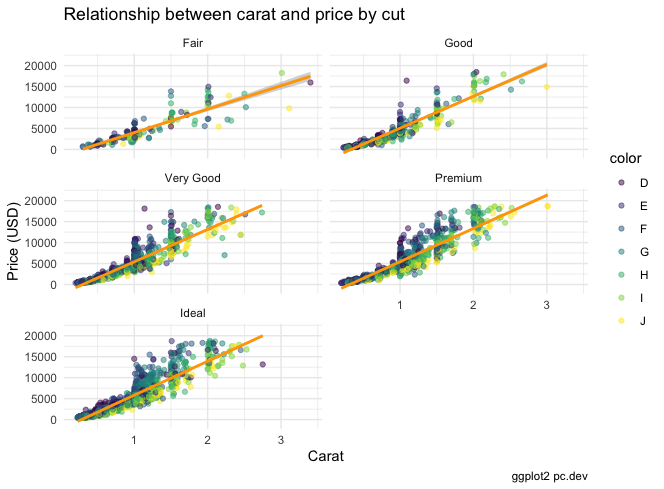

# Data Analysis using R Programming 🐳
Main package: `install.packages("tidyverse")`
- Data transformation
  - `dplyr`
- Data visualization
  - `ggplot2`
- R connecting to SQL server
  - `dbConnect(con)`


```R
# dplyr: select, filter, arrange, mutate, summarise
# eg.
mtcars %>%
  select(model_car, mpg, hp, wt, am) %>% # select
  filter(hp > 200 & mpg >= 10) %>% # filter
  arrange(desc(mpg)) %>% # sort default (ascending)
  filter(grepl("^C", model_car)) # regEx start with C
```

### ggplot2
```R
ggplot(samp, aes(carat, price, col=color)) +
  geom_point(alpha=0.5) +
  geom_smooth(method = 'lm', col='orange') +
  facet_wrap(~cut, ncol=2) +
  labs(
    title='Relationship between carat and price by cut',
    x='Carat',
    y='Price (USD)',
    caption='ggplot2 pc.dev'
  ) +
  theme_minimal()
```
